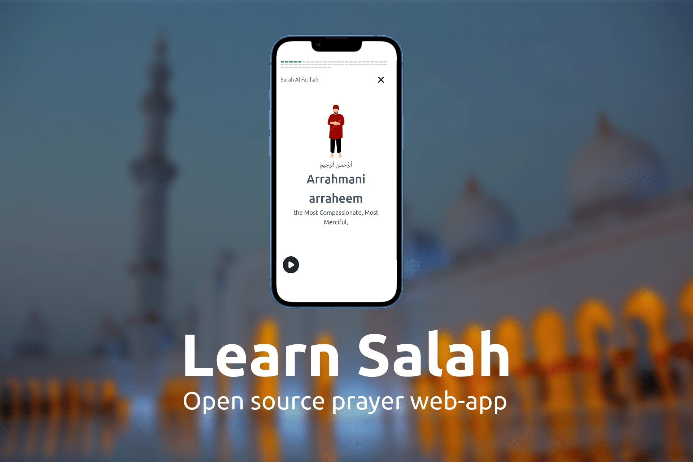

### Live at: [www.learnsalah.com](https://learnsalah.com)

## Table of Contents

- What is Learn Salah?
- Running Learn Salah
- Contributing 
- Directory Structure
- Licensing
- Host your own
- Current Instances

## What is Learn Salah

"Learn Salah" is an open-source, non-profit website crafted using SvelteKit, aimed at imparting knowledge on the Islamic act of devotion - Salah.

Our platform underscores the significance of a clean, accessible user interface that ensures quick load times. We uphold our commitment to maintaining a lean and efficient code base, delivering an optimal user experience.

Learn Salah is a community project, it does not belong to anyone and is free to use for everyone.

## Running "Learn Salah"

### Developing

First, clone this repo to your local machine:
```bash
git clone git@github.com:learnsalah/learnsalah.git && cd learnsalah
```

Next, install dependencies:

```bash
npm install
```

Aftwards, run the application:
```bash
npm run dev -- --host
```

### Building

To create a production version of your app:

```bash
npm run build
```

You can preview the production build with `npm run preview`.

## Contributing

```bash
#todo : Write contribution guide
```

## Directory Structure

```bash
#todo : Outline directory structure
```

## Licensing

"Learn Salah" is released under the MIT license. Some parts of the software maybe released under other licenses as specified.

Any user of this software shall indemnify and hold harmless "Learn Salah"'s developers from and against all allegations, claims, actions, suits, demands, damages, liabilities, obligations, losses, settlements, judgments, costs and expenses (including without limitation attorneys’ fees and costs) which arise out of, relate to or result from any use of this software by the user.

## Host your own

```bash
#todo : Links to guides to set-up own server
```

## Current Instances

- [www.learnsalah.com](https://learnsalah.com)
- [www.learnsalah.org](https://learnsalah.org) (points to [learnsalah.com](https://learnsalah.com))


